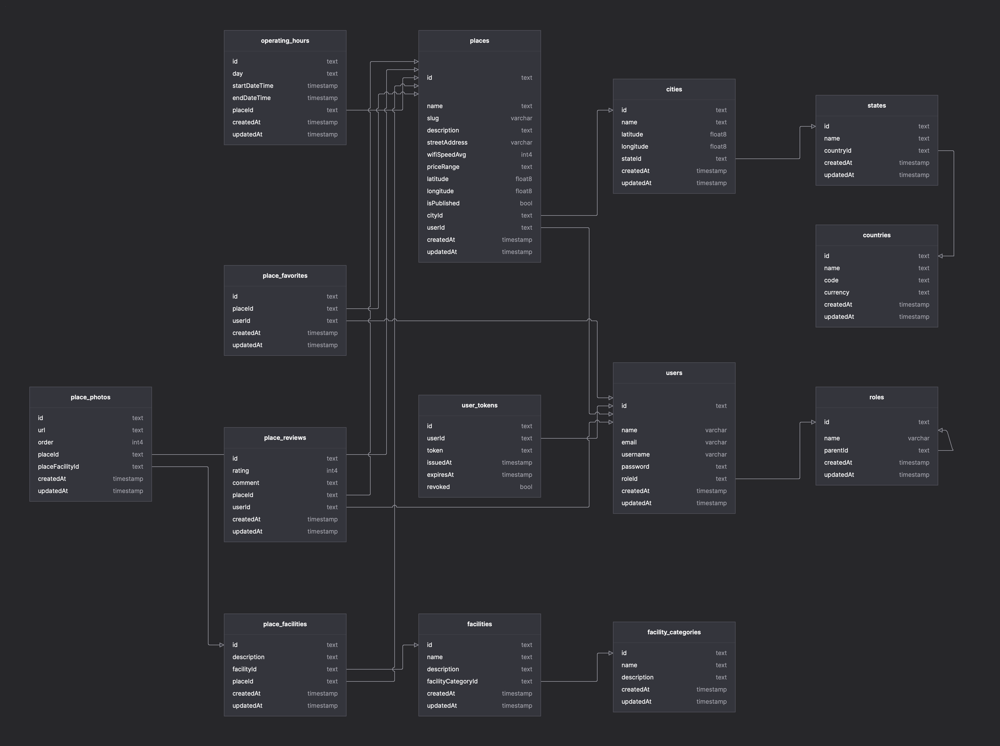

# CheckCafe API

**Checkcafe-API** is a comprehensive web API designed to provide detailed information about cafes in various locations. Built using Hono.js with Bun and TypeScript, this API aims to deliver both general and specific details about each café, making it easier for users to find their ideal coffee spot.

## Features

- User Authentication: Includes user registration, login, logout, and token refresh.
- Zod Validation: Schema validation for secure data handling.
- Swagger UI: Auto-generated API docs for easy testing and integration.
- Dynamic Role Access Control: Enhanced role management allowing for flexible access control based on user roles and hierarchy.
- Role Hierarchy Filtering: Implemented filtering logic to ensure only appropriate roles are included in access checks, improving security and clarity.
- Location and Address Information: Easily find cafes based on their address or location.
- Seating and Table Details: Get precise data on the seating capacity and the number of tables available in each café.
- Coffee Pricing: Access up-to-date information on the prices of different coffee options at various cafes.
- WiFi Speed: Check the WiFi speed available in the café to ensure a productive experience.

## Tech Stack (Framework & Libraries)

- Language: TypeScript
- Runtime: Bun
- Framework: Hono
- ORM: Prisma
- Database: PostgreSQL
- REST API: OpenAPI, Swagger, Scalar
- Data Validation: Zod

## Endpoints

| Endpoint            | Method | Description          |
| ------------------- | ------ | -------------------- |
| /auth/register      | POST   | Register a new user  |
| /auth/login         | POST   | Log in a user        |
| /auth/refresh-token | POST   | Refresh access token |
| /auth/logout        | POST   | Log out a user       |

<br>

| Endpoint      | Method | Description       |
| ------------- | ------ | ----------------- |
| /places       | POST   | Post a new place  |
| /places       | GET    | Get all places    |
| /places/:slug | GET    | Get place by slug |
| /places/:id   | PATCH  | Edit places       |

## ERD



## Setup and Usage

### Clone the repository and install dependencies:

```sh
git clone https://github.com/checkcafe-api/checkcafe-api.git
cd checkcafe-api
bun install
```

### Create a `.env` file in the root directory

```sh
cp .env.example .env
# edit .env with your own values
```

### Migrate and seed the database

```sh
bun migrate
bun seed
```

### Start the server

```sh
bun dev
# Open http://localhost:3000/ui in your browser
```

## Contributing

Contributions are welcome! If you find any issues or have suggestions for improvements, please open an issue or submit a pull request on the GitHub repository.

## License

This project is licensed under the MIT License. See the [LICENSE](LICENSE.md) file for more information.
